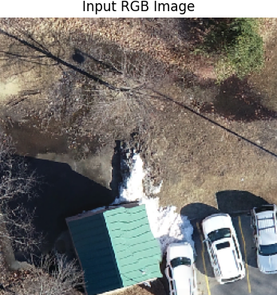
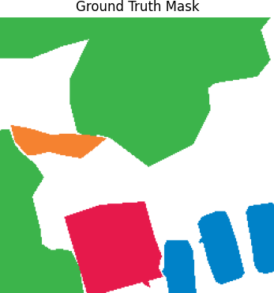
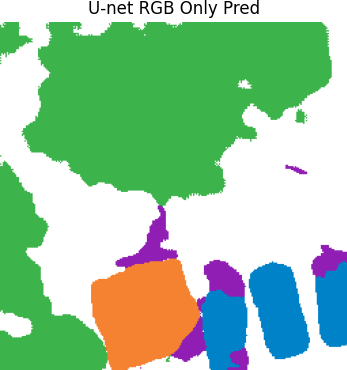

# 🛰️ Semantic Segmentation of Aerial Imagery - Drone Deploy


This project investigates the use of RGB and elevation (DEM) data to improve semantic segmentation of aerial imagery. Using both convolutional and transformer-based architectures, we evaluate the performance impact of multimodal fusion on per-pixel classification accuracy.

---

## Navigation
- [Home](README.md)
- [Showcase](SHOWCASE.md)
- [Code](_main.ipynb)

Welcome to the repository! Explore the project details and results.

---

## 👥 Contributors

- **Aron Bakes**
- **Deegan Marks**
- **Jordan Geltch-Robb**

---

## 📦 Dataset

This project uses the [Aerial Semantic Segmentation Dataset](https://drive.google.com/file/d/1FiQQ-fKHpBsOq0sp2e-GxNUtQSgvzAOY/view?usp=sharing). The dataset includes RGB, elevation, and slope maps with pixel-level annotations across six classes: building, clutter, vegetation, water, background, and car.

> **Note:** Dataset contains numerous annotation inconsistencies.

---

## 📁 Project Structure

```
├── SHOWCASE.md               # Project Overview
├── _main.ipynb               # Project entry point and main training loop
├── callbacks.ipynb           # Custom callbacks (early stopping, metrics)
├── data.ipynb                # Dataset generation, augmentations, loading
├── distribute.ipynb          # Strategy for training across multiple devices
├── inference.ipynb           # Visualisation and prediction for test data
├── models.ipynb              # Model definitions for U-Net and SegFormer
├── scoring.ipynb             # Evaluation metrics (IoU, F1, etc.)
├── segformer.ipynb           # SegFormer architecture implementation
├── training.ipynb            # Training configuration and execution
├── util.ipynb                # Utility functions and visualisation tools
├── scene_metadata.csv        # Tile-level metadata 
├── train_metadata.csv        # Scene-level metadata
├── data_gen.ipynb            # Data generator for GAN
├── models_gen.ipynb          # Models used for synthetic data creation
├── train_generator.ipynb     # Train GAN to produce synthetic data
├── LICENSE
└── README.md
```

---

## 🚀 Getting Started

### 1. Environment Setup

```bash
python3 -m venv venv
source venv/bin/activate
pip install -r requirements.txt
```

Dependencies include `tensorflow`, `numpy`, `opencv-python`, `matplotlib`, and others.

### 2. Prepare Dataset

Choose tile size and stride, defined at the top of chips.ipynb

```bash
TILE_SIZE = 512    # may need to reduce this if mewmory is limited
STRIDE = 256       # 50% overlap by default
```

Place raw imagery and labels in `dataset/`, create chipped data using:

```bash
python chips.py
```

Expected output directories:

`data/chipped/train/`   
├── `elevations/`  
├── `images/`  
├── `labels/`  
`data/train_metadata.csv`  

---

## 🧠 Model Training

Launch from `_main.ipynb` and select model/config:

```python
train_unet(
    model_type='enhanced_unet',        
    input_type='rgb',                  # or 'rgb_elev'
    epochs=80,
    batch_size=8,
    train_time=240,                    # minutes
    tile_size=512,
    verbose=1,
)

train_segformer(
    model_type='B0',                   # or 'B1', 'B2', 'B3', 'B4', 'B5'
    input_type='rgb',                  # or 'rgb_elev'
    epochs=80,
    batch_size=4,
    train_time=240,                    # minutes
    tile_size=512,
    verbose=1,
)
```

---

## ✅ Evaluation

Automatic evaluation runs at the end of training. 

```python
def evaluate_on_test(
    model: tf.keras.Model,
    test_gen: tf.data.Dataset,
    test_df: pd.DataFrame,
    out_dir: str,
    image_dir: str,
    label_dir: str,
    tile_size: int = 256,
    n_rows: int = 4,
    n_cols: int = 3,
) -> None:
    """Evaluates the model on the test set and generates metrics and visualisations.

    This includes mean IoU, macro F1, Precision, Recall, a confusion matrix,
    and a prediction visualisation grid.

    Args:
        model (tf.keras.Model): Trained segmentation model.
        test_gen (tf.data.Dataset): Test dataset generator.
        test_df (pd.DataFrame): DataFrame with test metadata including tile IDs.
        out_dir (str): Directory to save output plots.
        tile_size (int): Size of each tile in pixels (e.g. 256x256).
        n_rows (int): Number of rows in the prediction grid.
        n_cols (int): Number of columns in the prediction grid.
    """

```

---

## 📷 Sample Predictions

| RGB Image | Ground Truth | Prediction |
|-----------|--------------|------------|
|  |  |  |

---

## 🏷️ Class Labels

| ID | Class      | Colour (RGB)     |
|----|------------|------------------|
| 0  | Building   | (230, 25, 75)     |
| 1  | Clutter    | (145, 30, 180)    |
| 2  | Vegetation | (60, 180, 75)     |
| 3  | Water      | (245, 130, 48)    |
| 4  | Background | (255, 255, 255)   |
| 5  | Car        | (0, 130, 200)     |

---

## 📌 Notes

- Elevation/slope improves segmentation of buildings, roads, and water.
- Loss functions use CCE + Dice + Focal with tuned weights.
- Original dataset contains frequent inconsistencies.
- All models orginally trained and tested on 256x256 image tiles, later changed to 512×512 image tiles for better generalisation.

---

## 📄 License

See the [LICENSE](LICENSE) file for details.

