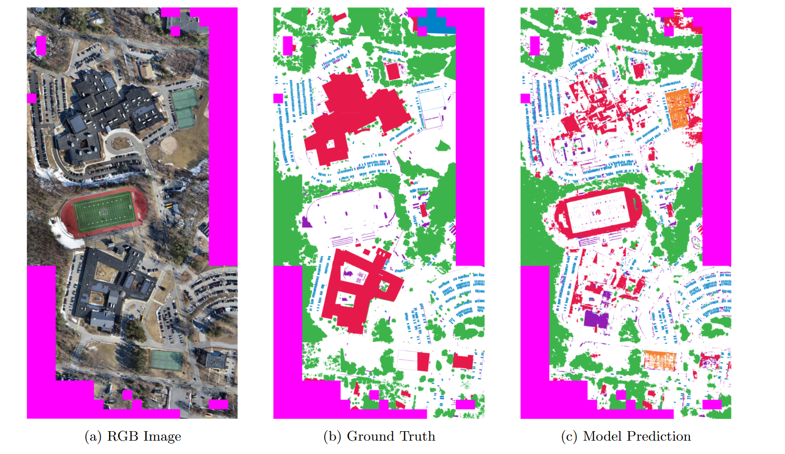

# Showcase: Semantic Segmentation of Aerial Imagery with RGB and Elevation Data

## Overview
This project builds on the CAB420 Machine Learning Report (June 17, 2025) by enhancing aerial imagery segmentation with RGB and elevation data. It showcases a pre-trained U-Net model on an updated DroneDeploy dataset, shifting from 256x256 to 512x512 images and adding Roads (replacing Water), aiming for a 10% mIoU improvement. All results are pre-computed, meaning they were generated previously with the 600MB model (not included here) to enable static viewing without execution or GPU needs.

## Key Updates from the Report
- **Dataset Evolution**: Original dataset (Water, Building, Clutter, Vegetation, Background, Car) updated by adding Roads (replacing Water), removing Clutter due to ambiguity, and swapping Water (blue) and Car colors for better visual clarity, with a 10% mIoU gain.
- **Resolution Boost**: Increased from 256x256 to 512x512 images for better generalization, reducing batch size to a quarter (e.g., from 32 to 8) due to higher memory needs.
- **Model Approach**: U-Net and SegFormer built from scratch without pre-training, as elevation data required custom architectures unsuitable for ImageNet backbones.
- **Class Balance**: Updates balanced the distribution, though aerial imagery remains inherently imbalanced.

## Data Insights
### Chipping and Original Dataset
The DroneDeploy dataset was chipped into 256x256 tiles, later upscaled to 512x512. Figure 1 shows a sample: RGB, elevation, and label map.

**Pre-computed Output**:  
- **Sample Image**:   

### Class Distribution (Original)
The original dataset’s class distribution highlights severe imbalance, dominated by Background.

**Pre-computed Output**:  
- **Class Distribution**:   

### Augmentation: CutMix on Water
CutMix was applied to Water to address class imbalance, mixing patches to enhance training.

**Pre-computed Output**:  
- **CutMix on Water**:   

### Re-labeling the Dataset
The dataset was updated by adding the Road class (replacing Water), removing the ambiguous Clutter class, and swapping Water (now blue) and Car colors for clarity. Errors were fixed, and resolution adjusted to 512x512, improving mIoU by 10%. A new label example is shown below.

**Pre-computed Output**:  
- **New Road Label**:   

### Class Distribution (Re-labeled)
The re-labeled dataset’s distribution reflects the new class balance after adding Roads, removing Clutter, and adjusting colors.

**Pre-computed Output**:  
- **Re-labeled Class Distribution**:   

## Segmentation Models
### Loss Functions
A custom loss combined Categorical Cross-Entropy (0.25), Dice Loss (1.75), and Focal Loss (2.5, gamma=4) to handle imbalance. Class weights, fine-tuned and normalized, were used as alpha in Focal Loss and integrated into Dice Loss to prioritize hard cases. Additionally, 10% label smoothing was applied to improve generalization.

## Evaluation
### RGB vs RGB + Elevation
Elevation data boosted mIoU: U-Net from 0.3985 (RGB) to 0.4295 (RGB+Elevation).

**Pre-computed Output**:  
- **RGB vs RGB+Elevation**:   

### New Plot
A new performance metric highlights the model’s progress.

**Pre-computed Output**:  
- **New Performance Plot**:   

### Confusion Matrices
Confusion matrices compare U-Net performance across configurations. The matrices are displayed side by side for comparison.

| RGB Only (Old Labels)       | RGB+Elevation (Old Labels) | RGB Only (New Labels) |
|-----------------------------|----------------------------|-----------------------|
|  |  |  |

### Reconstruction Results
The U-Net model’s segmentation output is validated through full-tile reconstruction, stitching chipped predictions back into the original image. Figure 2 illustrates a reconstructed output, showcasing the model’s ability to segment classes like Roads and Buildings with improved spatial coherence, particularly with the re-labeled dataset.

**Pre-computed Output**:  
- **Reconstruction Output**:   

### IoU Performance Per Class
Table 1 shows IoU improvements per class with re-labeling. Note: The reported 10% mIoU improvement (from 0.4295 to ~0.4725) doesn’t fully align with the new labels mIoU (0.5256), suggesting a potential evaluation difference (e.g., RGB vs. RGB+Elevation) or calculation error—verify with your data.

| Class         | U-Net (RGB) | U-Net (RGB+Elev) | U-Net (RGB, New Labels) |
|---------------|-------------|------------------|-------------------------|
| Building      | 0.3658      | 0.5409           | 0.6184                  |
| Clutter       | 0.1320      | 0.1609           | --                      |
| Vegetation    | 0.5942      | 0.6012           | 0.7417                  |
| Water         | 0.0521      | 0.0548           | 0.4931                  |
| Background    | 0.7046      | 0.7263           | 0.7346                  |
| Car           | 0.5426      | 0.4927           | 0.0620                  |
| Road          | --          | --               | 0.5039                  |
| **mIoU**      | 0.3985      | 0.4295           | 0.5256                  |

## Conclusion
This showcase highlights the U-Net model’s success with 512x512 images and re-labeled data, aiming for a 10% mIoU boost via Roads, Clutter removal, and color swaps. Elevation enhanced man-made structure detection, with re-labeling and custom loss strategies (class weights, 10% smoothing) refining accuracy. All results are pre-computed as of 08:05 PM AEST, June 30, 2025, using a 600MB model trained from scratch, not included here. Explore these static visuals without GPU needs!

**Note**: Figures are in the `output` folder. The 600MB `segmentation_model.keras` is unavailable; contact the author for access if needed. The mIoU discrepancy suggests further validation.